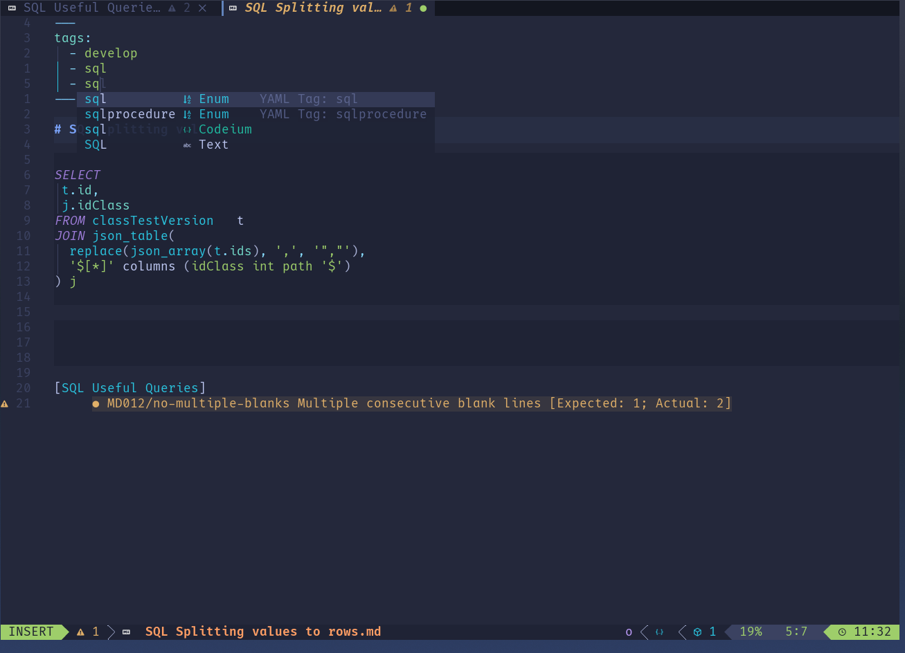
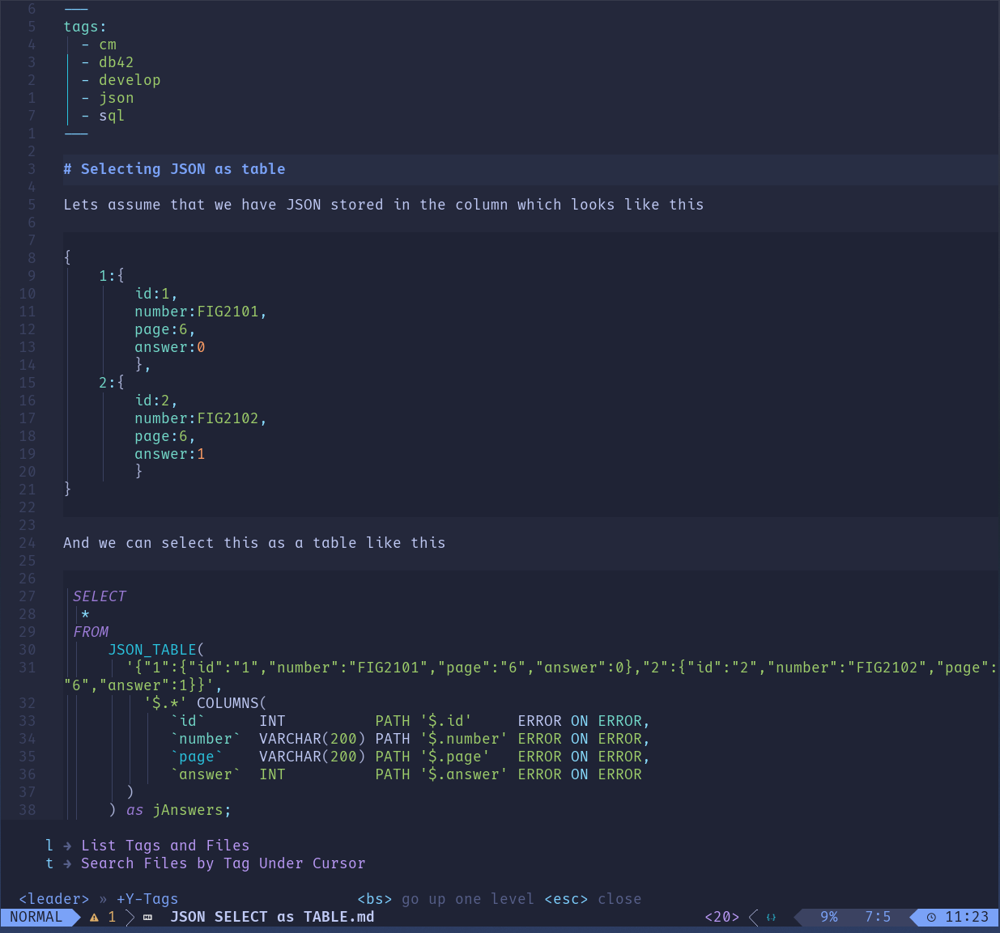
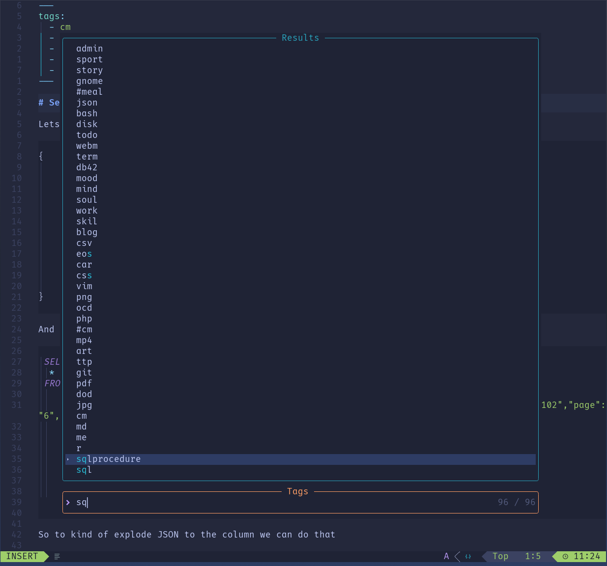

# yaml-tags.nvim

Tags facilitator for `markdown` files.

## Features

This plugin offers the following features:

- **Tag Scanning and Storage**:
  - Scans markdown files for tags within the YAML front-matter.
  - Creates a `.my_tags.json` file with a unique list of tags.
- **Completion Source**:
  - Adds a new completion source with the tags.
  - The completion source is available only when the cursor is in the YAML front-matter `tags:` section.
- **Tag Sanitization**:
  - Sanitizes tags in the YAML front-matter by removing duplicate tags and sorting them alphabetically.
  - This feature can be switched off via the configuration.
- **Tag-based File Search**:
  - Provides a command to get the list of files containing the tag under the cursor.
  - Displays the list of tags and the files containing them.

## Installation

You can install `yaml-tags.nvim` using your preferred package manager. For example, with `lazy`:

```lua
 {
  "praczet/yaml-tags.nvim",
  config = function()
    require("yaml-tags").setup({
      sanitizer = true, -- Set to false to disable the sanitizer
    })
  end,
  dependencies = {
    "nvim-telescope/telescope.nvim", -- for file and tag search
  }
}
```

## Configuration

You can configure the plugin by passing options to the setup function:

```lua
require("yaml-tags").setup({
  sanitizer = true, -- Enable or disable the sanitizer
})
```

## Usage

The yaml-tags plugin is enabled by default only for the markdown files.
Most of the "job" are done in section `tags:` in the yaml front-matter.

### Completion

To activate completion the cursor has to be in the YAML front-matter `tags:` section:



### Calling `tag under the cursor` and `tag list` commands



When the cursor is in the YAML front-matter `tags:` section over the tag plugin
allow to view markdown files containing that tag `<leader>nt`.


To see list off all tags just press `<leader>nl`.



## Key Mappings

You can set up key mappings to quickly access the plugin's features. For example:

```lua
vim.api.nvim_set_keymap(
  "n",
  "<leader>nt",
  '<cmd>lua require("yaml-tags.tags_completion").search_files_by_tag_under_cursor()<CR>',
  { noremap = true, silent = true }
)
vim.api.nvim_set_keymap(
  "n",
  "<leader>nl",
  '<cmd>TelescopeTags<CR>',
  { noremap = true, silent = true }
)
```

## Autocommands

The plugin sets up an autocommand to sanitize YAML tags before saving:

```lua
vim.api.nvim_create_autocmd("BufWritePre", {
  pattern = "*.md",
  callback = function()
    require("yaml-tags").sanitize_current_buffer()
  end,
})
```

## Example

Here's an example of how you can use the plugin in your init.lua or init.vim:

```lua

require("yaml-tags").setup({
  sanitizer = true, -- Set to false to disable the sanitizer
})

-- Ensure the plugin initializes correctly
require("yaml-tags").initialize()
```

## Tag repository `.my_tags.json`

In the director with the markdown files you can find the `.my_tags.json` file
which contains a list of tags and information about date of last modification.

```json
{
  "last_mod": "2024-06-25 11:33:28",
  "tags": [
    "cm",
    "dataview",
    "ideas",
    "links",
    "#meal",
    "#obsidian",
    "#procreate",
    "admin",
    "art",
    "ascii",
    "backup",
    "base13",
    "bash",
    "blender",
    "blog"
  ]
}
```

## TODO

- [ ] Configuration option for allowing / disallowing specific files
      to be excluded from the tag search
- [ ] Tag under the cursor - should check if the cursor is in the YAML
      front-matter in `tags:` section
- [ ] Some more tests
- [ ] Few features:
  - [ ] add tag based on the word under the cursor
  - [ ] add tag from selected text
