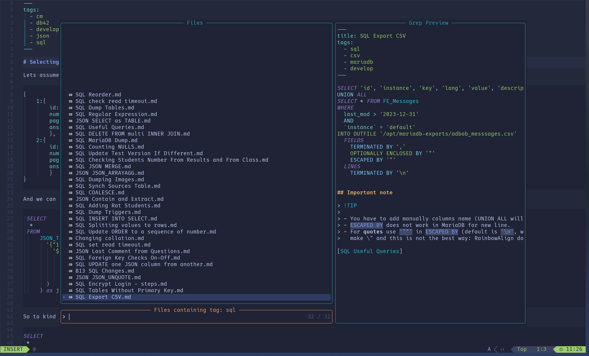

# yaml-tags.nvim

Tags facilitator for `markdown` files.

## Features

This plugin offers the following features:

- **Tag Scanning and Storage**:
  - Scans markdown files for tags within the YAML front-matter.
  - Creates a `.my_tags.json` file with a unique list of tags.
- **Completion Source**:
  - Adds a new completion source with the tags.
  - The completion source is available only when the cursor is in the YAML
    front-matter `tags:` section.
- **Tag Sanitization**:
  - Sanitizes tags in the YAML front-matter by removing duplicate tags
    and sorting them alphabetically.
  - This feature can be switched off via the configuration.
- **Tag-based File Search**:
  - Provides a command to get the list of files containing the tag under the cursor.
  - Displays the list of tags and the files containing them.

## Installation

You can install `yaml-tags.nvim` using your preferred package manager.
For example, with `lazy`:

```lua
 {
  "praczet/yaml-tags.nvim",
  config = function()
    require("yaml-tags").setup({
      sanitizer = true, -- Set to false to disable the sanitizer
    })
  end,
  dependencies = {
    "nvim-telescope/telescope.nvim", -- for file and tag search
  }
}
```

## Dependency

- **nvim-cmp:** For completion.
- **telescope.nvim:** For fuzzy finding and file search.
- **lspkind-nvim:** For icons in completion.
- **luafilesystem:** To interact with the file system.
- **lua-cjson:** For JSON handling.

## Configuration

You can configure the plugin by passing options to the setup function:

```lua
require("yaml-tags").setup({
  sanitizer = true,
 tag_formatting = {
  allow_camel_case = false,
  allowed_characters = "abcdefghijklmnopqrstuvwxyzABCDEFGHIJKLMNOPQRSTUVWXYZ0123456789",
 },
 forbidden_words = { "and", "is", "or", "a", "the", "not" },
 excluded_directories = {},
 included_directories = {},
})

```

### Options

- **sanitizer:** Enable or disable the sanitizer (default: _true_).
- **tag_formatting:** Table to configure tag formatting options.
  - **allow_camel_case** Allow camel case in tags (default: _false_ ).
  - **allowed_characters:** String of allowed characters in tags
    (default: "abcdefghijklmnopqrstuvwxyzABCDEFGHIJKLMNOPQRSTUVWXYZ0123456789").
- **forbidden_words:** List of words that should not be allowed as tags
  (default: { "and", "is", "or", "a", "the", "not" }).
- **extend_forbidden_words:** Allow to extend the forbidden words list rather
  then replacing it. (default: _false_).
- **excluded_directories:** List of directories to exclude (default: {}).
- **included_directories:** List of directories to include (default: {}).

### Included and Excluded directories

1. Absolute and Relative paths
   > Directory can be absolute or relative to the current working directory
2. If `included_directories` and `excluded_directories` are empty,
   all directories are included
3. If `included_directories` is not empty, only directories in the list are included
4. If `excluded_directories` is not empty, only directories not in the list are included

## Usage

The yaml-tags plugin is enabled by default only for the markdown files.
Most of the "job" are done in section `tags:` in the yaml front-matter.

### Completion

To activate completion the cursor has to be in the YAML front-matter `tags:` section:


### Calling `tag under the cursor` and `tag list` commands


When the cursor is in the YAML front-matter `tags:` section over the tag plugin
allow to view markdown files containing that tag `<leader>nt`.


To see list off all tags just press `<leader>nl`.


## Key Mappings

This plugin registers the following key bindings using which-key:

### Normal Mode

- **\<leader\>ya:** Add tags from selection.
- **\<leader\>yl:** List tags and files containing them.
- **\<leader\>yt:** Search files by tag under cursor.

### Visual Mode

- **\<leader\>ya:** Add tags from selection.

## Autocommands

The plugin sets up an autocommand to sanitize YAML tags before saving:

```lua
vim.api.nvim_create_autocmd("BufWritePre", {
  pattern = "*.md",
  callback = function()
    require("yaml-tags").sanitize_current_buffer()
  end,
})
```

## Example

Here's an example of how you can use the plugin in your init.lua or init.vim:

```lua

require("yaml-tags").setup({
  sanitizer = true, -- Set to false to disable the sanitizer
})

-- Ensure the plugin initializes correctly
require("yaml-tags").initialize()
```

## Tag repository `.my_tags.json`

In the director with the markdown files you can find the `.my_tags.json` file
which contains a list of tags and information about date of last modification.

```json
{
  "last_mod": "2024-06-25 11:33:28",
  "tags": [
    "cm",
    "dataview",
    "ideas",
    "links",
    "#meal",
    "#obsidian",
    "#procreate",
    "admin",
    "art",
    "ascii",
    "backup",
    "base13",
    "bash",
    "blender",
    "blog"
  ]
}
```

## TODO

- [x] Configuration option for allowing / disallowing specific files
      to be excluded from the tag search
- [x] Tag under the cursor - should check if the cursor is in the YAML
      front-matter in `tags:` section
- [ ] Some more tests
- [x] Few features:
  - [x] add tag based on the word under the cursor
  - [x] add tag from selected text [[\#1](https://github.com/Praczet/yaml-tags.nvim/issues/1)]
